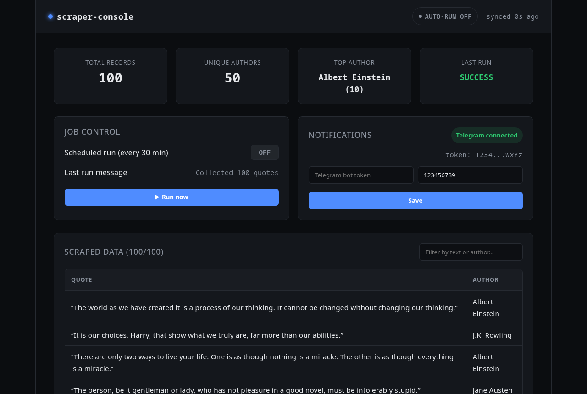

# Scraping Practice

A collection of Python web scraping exercises (Playwright, Requests/BeautifulSoup, pandas, exports, scheduling, Docker) that grew into a small full-stack **scraper control dashboard**.

## 🖥️ Dashboard

A FastAPI backend + React (TypeScript) frontend for controlling a scheduled scraper: toggle scheduled runs on/off, trigger a manual run, browse the collected data, and configure Telegram notifications on success/failure.

**Stack:** FastAPI · APScheduler · SQLite · Requests/BeautifulSoup · React · TypeScript · Vite



### Features

- Enable/disable scheduled scraping via API, no server access needed
- Trigger a scrape run on demand
- Live dashboard: record count, unique authors, top author, last run status
- Search/filter over scraped data
- Telegram bot notifications on job success/failure
- Retry logic with exponential backoff for network resilience

### Running it

**Backend:**
```bash
cd dashboard/backend
python -m venv .venv
source .venv/bin/activate   # or .venv/bin/activate.fish for fish shell
pip install -r requirements.txt
uvicorn app.main:app --reload --port 8001
```
Interactive API docs: `http://localhost:8001/docs`

**Frontend:**
```bash
cd dashboard/frontend
npm install
npm run dev
```
Open `http://localhost:5173` (or the port Vite reports if 5173 is busy).

## 📚 Lessons

Step-by-step exercises this project was built on, each in its own folder with a README:

1. **Playwright** — first browser-automation scraper
2. **Pagination** — multi-page scraping, CSV export
3. **Requests & BeautifulSoup** — static-site scraping without a browser
4. **Retry logic & rate limiting** — resilience against flaky networks
5. **Pandas** — cleaning, deduplication, filtering
6. **Export formats** — JSON, Excel, SQLite
7. **Google Sheets API** — writing results to a live spreadsheet
8. **cron / systemd timers** — scheduled execution on a VPS
9. **Docker** — containerizing the scraper

### Setup (for the lesson scripts)

```bash
python -m venv .venv
source .venv/bin/activate
pip install -r requirements.txt
playwright install chromium
```
